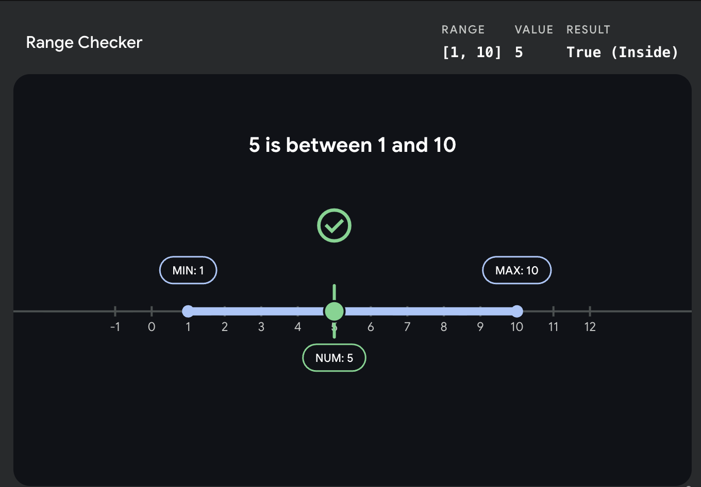

# Is Between



Your goal is to write a function called `isBetween`. It does exactly you think. The function should take three arguments: `num`, `min`, and `max`. The function should `true` or `false` if num is in between min and max inclusive.

To run the specs follow these commands:

```shell
# install dependencies
npm install

# run the tests
npm test
```
